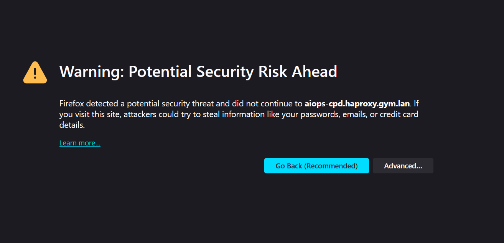
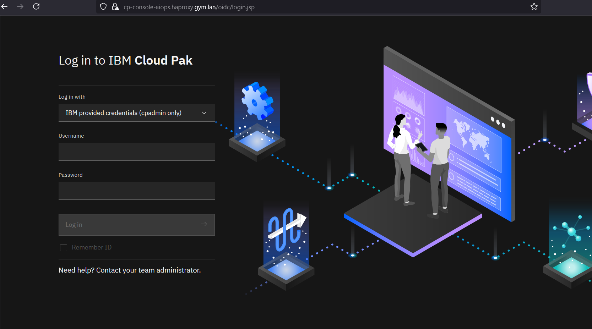
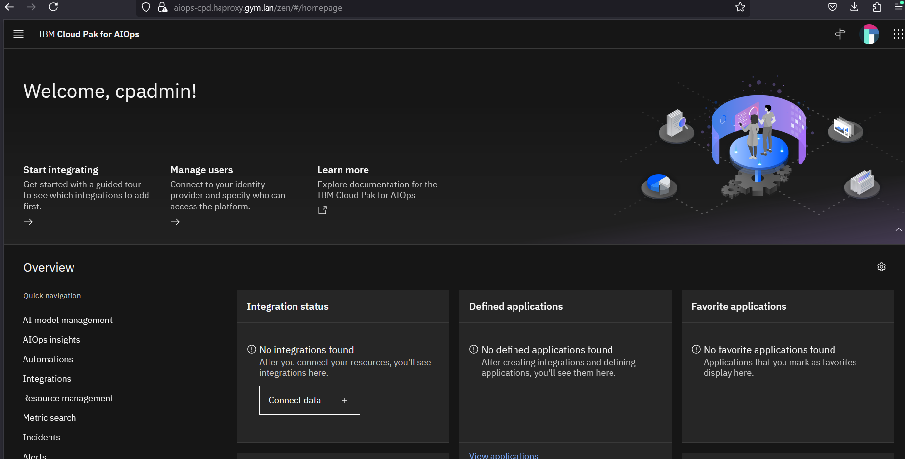

# Depoy AIOps on vSphere

Deploy in under 60 minutes an AIOPs on Linux cluster.

## Requirements

* [Terraform](https://www.terraform.io/) - Terraform is an open-source infrastructure as code software tool that provides a consistent CLI workflow to manage hundreds of cloud services. Terraform codifies cloud APIs into declarative configuration files.
* vSphere account - Access to vSphere with the proper authorization to create VMs

---

## Before you start

You will need an IBM entitlement key to install AIOps. This can be obtained [here](https://myibm.ibm.com/products-services/containerlibrary).

---

## IBM TechZone Access to vSphere

If you are an IBMer or Business Parter, you can request access to vSphere through IBM TechZone.

[VMware on IBM Cloud Environments](https://techzone.ibm.com/collection/tech-zone-certified-base-images/journey-vmware-on-ibm-cloud-environments)

Select `Request vCenter access (OCP Gym)`

---

## Pre flight checklist

### 🛠️ Preparing a RHEL 9 Template for Terraform on vSphere

To use this Terraform code to deploy virtual machines on vSphere, you first need a **VM template**. Here's how to create one using a RHEL 9 image.

---

#### 1. 🎯 Define the Goal

You want to deploy VMs using Terraform, but Terraform needs a **pre-existing VM template** to clone from.

---

#### 2. 🧱 Use the Red Hat Image Builder

Red Hat provides a tool to generate OVA files for RHEL 9. This is a convenient way to create a VM image that can be imported into vSphere.

> 🔗 You can find the [image builder](https://console.redhat.com/insights/image-builder/) on the Red Hat Customer Portal.

---

#### 3. 📦 Deploy the OVA to vSphere

Once you have the OVA file:

1. Open **vSphere Client**.
2. Go to **Deploy OVF Template**.
3. Upload the RHEL 9 OVA.
4. Follow the wizard to deploy it as a VM or template.

### Install Terraform

> 💡 **Tip:** If you're connecting to vSphere through a **WireGuard VPN**, you might experience **timeouts or connectivity issues**.  
> In such cases, consider running your Terraform commands from a **bastion host** that resides **within the same network or environment** as vSphere.  
> This can help avoid VPN-related latency or firewall restrictions that interfere with the connection.

To install **Terraform** from a **RHEL 8** bastion host, follow these steps:

---

#### ✅ Step-by-Step Installation Guide

##### 1. **Install Required Packages**
Open a terminal and run:

```bash
sudo dnf install -y yum-utils git bind-utils
```

##### 2. **Add the HashiCorp Repository**
Create a new repo file:

```bash
sudo tee /etc/yum.repos.d/hashicorp.repo <<EOF
[hashicorp]
name=HashiCorp Stable - RHEL 8
baseurl=https://rpm.releases.hashicorp.com/RHEL/8/\$basearch/stable
enabled=1
gpgcheck=1
gpgkey=https://rpm.releases.hashicorp.com/gpg
EOF
```

##### 3. **Install Terraform**
Now install Terraform:

```bash
sudo dnf install -y terraform
```

##### 4. **Verify Installation**
Check the installed version:

```bash
terraform -version
```

### Configure Networking

> 💡 **Important:** Currently this Terraform module assumes that the network is **192.168.252.0/24**.
> This is hard-coded into the module, sorry.

#### Required Static IPs

There are 4 static IP addresses that are needed.

| Type         | Hostname       | IP               | FQDN                  |
|--------------|----------------|------------------|------------------------|
| `haproxy`    | `haproxy`      | `192.168.252.9`  | `haproxy.gym.lan`      |
| `k3s server` | `k3s-server-0` | `192.168.252.10` | `k3s-server-0.gym.lan` |
| `k3s server` | `k3s-server-1` | `192.168.252.11` | `k3s-server-1.gym.lan` |
| `k3s server` | `k3s-server-2` | `192.168.252.12` | `k3s-server-2.gym.lan` |

The example table above assumes the `base_domain` is set to `gym.lan`

#### 🛠️ How to Set Static IPs in pfSense

1. **Log in to pfSense** via the web UI (usually at `https://192.168.252.1`).
2. Navigate to:  
   **Services** → **DNS Forwarder**.
3. Scroll down to **Host Overrides**.
4. For each device:
   - Click **Add**.
   - Set the **IP address** (from the table above).
   - Set the **Hostname** (e.g., `haproxy`).
   - Set the **Domain** to `gym.lan` (or appropriate base domain) to form the FQDN.
   - Click **Save**.
5. Click **Apply Changes** at the top of the page.

---

#### 🔁 Verifying DNS Resolution

To ensure the FQDNs resolve correctly:

- Test resolution using:

```bash
nslookup haproxy.gym.lan
```

#### 🧭 Enable DNS Forwarder Static Mapping Registration in pfSense

To ensure that your static DHCP mappings (like `k3s-agent-0.gym.lan`, etc.) are resolvable via DNS, you need to enable a specific setting in pfSense:

##### ✅ Steps

1. Log in to the **pfSense Web UI**.
2. Navigate to:  
   **Services** → **DNS Forwarder**.
3. Scroll down to the **General DNS Forwarder Options** section.
4. Check the box for: **Register DHCP static mappings in DNS forwarder**
5. Click **Save** and then **Apply Changes**.

> 💡 This setting controls whether hostnames assigned to static DHCP clients are automatically added to the DNS forwarder or resolver so they can be resolved locally.

### Clone the repository

Clone this repository to your local workstation. This will allow you to configure and run terraform.

#### 1. **Install Required Packages**
Open a terminal and run:

```bash
sudo dnf install -y git bind-utils
```

#### 2. **Clone the repo**
Now clone this repo:

```bash
git clone <repo>
```

### Define Terraform variables

There is a file called `terraform.tfvars.example`. Copy this file to `terraform.tfvars` and set variables here according to
your needs.

<!--
| Var   | Required | Desc |
| ------- | ------- | ----------- |
| `cluster_name` | `yes`        | the name of your K3s cluster. Default: k3s-cluster |
| `common_prefix`  | `no`  | Prefix used in all resource names/tags. Default: k3s |
| `ibm_entitlement_key` | `yes` | The installation entitlement key for AIOps |
| `accept_license` | `yes` | Set to "true" to accept license. |
| `aiops_version` | `yes` | Set to the version you want to install (e.g. "4.9.0") |
| `ignore_prereqs` | `no` | If set to `true` the installation will continue even if prerequisites are not met. This can be useful for development, for instance you can install a base version with only 5 worker nodes successfully. |
| `k3s_server_desired_capacity` | `no`        | Desired number of k3s servers. Default 3 |
| `k3s_server_min_capacity` | `no`        | Min number of k3s servers: Default 3 |
| `k3s_server_max_capacity` | `no`        |  Max number of k3s servers: Default 4 |
| `k3s_worker_desired_capacity` | `no`        | Desired number of k3s workers. Default 7 |
| `k3s_worker_min_capacity` | `no`        | Min number of k3s workers: Default 5 |
| `k3s_worker_max_capacity` | `no`        | Max number of k3s workers: Default 9 |
-->

## Deploy

We are now ready to deploy our infrastructure. First we ask terraform to plan the execution with: 

```
terraform plan
```

If everything is ok the output should be something like this:

```
...skip

Plan: 14 to add, 0 to change, 0 to destroy.

Changes to Outputs:
  + aiops_etc_hosts    = (known after apply)
  + haproxy_ip_address = (known after apply)
  + vm_ip_addresses    = [
      + (known after apply),
      + (known after apply),
      + (known after apply),
    ]
```

now we can deploy our resources with:

```
terraform apply
```

Sample output:
```
...skip

Plan: 14 to add, 0 to change, 0 to destroy.

Changes to Outputs:
  + aiops_etc_hosts    = (known after apply)
  + haproxy_ip_address = (known after apply)
  + vm_ip_addresses    = [
      + (known after apply),
      + (known after apply),
      + (known after apply),
    ]

Do you want to perform these actions?
  Terraform will perform the actions described above.
  Only 'yes' will be accepted to approve.

  Enter a value: yes

...skip

Apply complete! Resources: 14 added, 0 changed, 0 destroyed.

Outputs:

aiops_etc_hosts = <<EOT
192.168.252.9 aiops-cpd.haproxy.gym.lan
192.168.252.9 cp-console-aiops.haproxy.gym.lan
EOT
haproxy_ip_address = "192.168.252.9"
vm_ip_addresses = [
  "192.168.252.10",
  "192.168.252.11",
  "192.168.252.12",
]
```

### Check progress of installation

It takes about **5 minutes** for the actual installation to start. You can ssh to any of the control plan nodes found in the output of `vm_ip_addresses` using `clouduser`. The following command opens an SSH session with `k3s-server-0`.

```bash
sed -i '/^k3s-/d' ~/.ssh/known_hosts && ssh -o StrictHostKeyChecking=no -i ./id_rsa clouduser@k3s-server-0
```

> 💡 **Tip:** The default password for clouduser is `mypassword`

Change to the root user on the control plane node.

```bash
sudo su -
```

Run the `aiopsctl` command to see the installation status.

```bash
aiopsctl status
```
Sample output:
```
o- [03 Jun 25 14:58 EDT] Getting cluster status
Control Plane Node(s):
    k3s-server-0.gym.lan Ready
    k3s-server-1.gym.lan Ready
    k3s-server-2.gym.lan Ready

Worker Node(s):
    k3s-agent-0.gym.lan Ready
    k3s-agent-1.gym.lan Ready
    k3s-agent-2.gym.lan Ready
    k3s-agent-3.gym.lan Ready
    k3s-agent-4.gym.lan Ready
    k3s-agent-5.gym.lan Ready

o- [03 Jun 25 14:58 EDT] Checking AIOps installation status

  15 Unready Components
    aiopsui
    asm
    issueresolutioncore
    baseui
    cluster
    aiopsedge
    zenservice
    aimanager
    commonservice
    aiopsanalyticsorchestrator
    kafka
    lifecycletrigger
    lifecycleservice
    elasticsearchcluster
    rediscp

  [WARN] AIOps installation unhealthy
```

The install can take up to 45 minutes to complete.

### Helpful commands during install

All commands below should be run as root from a control plane node.

List the nodes:
```bash
kubectl get nodes
```

Sample output:
```
NAME                   STATUS   ROLES                       AGE     VERSION
k3s-agent-0.gym.lan    Ready    worker                      5m38s   v1.31.7+k3s1
k3s-agent-1.gym.lan    Ready    worker                      5m38s   v1.31.7+k3s1
k3s-agent-2.gym.lan    Ready    worker                      5m38s   v1.31.7+k3s1
k3s-agent-3.gym.lan    Ready    worker                      5m37s   v1.31.7+k3s1
k3s-agent-4.gym.lan    Ready    worker                      5m39s   v1.31.7+k3s1
k3s-agent-5.gym.lan    Ready    worker                      5m41s   v1.31.7+k3s1
k3s-server-0.gym.lan   Ready    control-plane,etcd,master   5m56s   v1.31.7+k3s1
k3s-server-1.gym.lan   Ready    control-plane,etcd,master   5m21s   v1.31.7+k3s1
k3s-server-2.gym.lan   Ready    control-plane,etcd,master   5m10s   v1.31.7+k3s1
```

List all pods:
```
kubectl get pods -A
```

Sample output (note that during install, some unhealthy pods are expected):
```
NAMESPACE             NAME                                                              READY   STATUS                       RESTARTS        AGE
aiops                 aimanager-operator-controller-manager-6866676848-w2bbp            1/1     Running                      0               7m6s
aiops                 aiops-entitlement-check-9vk99                                     0/1     Completed                    0               11m
aiops                 aiops-ibm-elasticsearch-es-server-all-0                           2/2     Running                      0               7m58s
aiops                 aiops-ibm-elasticsearch-es-server-all-1                           2/2     Running                      0               7m58s
aiops                 aiops-ibm-elasticsearch-es-server-all-2                           2/2     Running                      0               7m58s
aiops                 aiops-installation-edb-postgres-1                                 1/1     Running                      0               7m11s
aiops                 aiops-installation-edb-postgres-2                                 1/1     Running                      0               6m28s
aiops                 aiops-installation-edb-postgres-3                                 1/1     Running                      0               2m40s

...skip
```

List all pods that are in unhealthy state:
```
kubectl get pods -A | grep -vE 'Completed|([0-9]+)/\1'
```

Sample output (again, unhealthy pods are expected during install):
```
NAMESPACE             NAME                                                              READY   STATUS                       RESTARTS        AGE
aiops                 aiops-ir-analytics-cassandra-setup-crfz7                          0/1     CrashLoopBackOff             5 (43s ago)     7m2s
aiops                 aiops-ir-core-archiving-setup-cwl2s                               0/1     Init:0/1                     0               6m57s
aiops                 aiops-ir-lifecycle-create-policies-job-6xdkx                      0/1     Init:0/2                     0               5m46s
aiops                 aiops-ir-lifecycle-policy-registry-svc-c79f97567-lxtq8            0/1     Init:CrashLoopBackOff        5 (80s ago)     5m46s
aiops                 aiops-ir-lifecycle-policy-registry-svc-c79f97567-vrfzw            0/1     Init:CrashLoopBackOff        5 (91s ago)     5m46s
aiops                 aiops-topology-cassandra-1                                        0/1     Running                      0               16s
aiops                 aiopsedge-generic-topology-integrator-5fd9b478cd-kh8xv            0/1     Init:0/1                     0               5m13s
aiops                 aiopsedge-generic-topology-integrator-f9b677db5-lt9xp             0/1     Init:0/1                     0               5m12s
aiops                 aiopsedge-im-topology-integrator-5bd84594b-w5q9s                  0/1     Init:0/1                     0               5m7s
aiops                 aiopsedge-im-topology-integrator-869dc6f6fc-n7st5                 0/1     Init:0/1                     0               5m9s
aiops                 aiopsedge-instana-topology-integrator-845fb497dd-5xg7z            0/1     Init:0/1                     0               5m7s
aiops                 aiopsedge-instana-topology-integrator-8466585ffc-hwpj5            0/1     Init:0/1                     0               5m3s
aiops                 cp4waiops-metricsprocessor-9b9864cf4-7fj2v                        0/1     CreateContainerConfigError   0               7m25s
aiops                 usermgmt-57c56b4c4b-dsq4c                                         0/1     Running                      0               24s
aiops                 usermgmt-57c56b4c4b-pf5jb                                         0/1     Running                      0               24s
```

Follow the launch template script output:
```
tail -f /var/log/cloud-init-output.log
```
This can be run from any node, it will show the verbose output of the launch scripts found in this repo under `cloudinit` for the appropriate node or instance type.

### Install complete

Once the install is complete, the `aiopsctl status` command run from a control node will show the following.

```
o- [03 Jun 25 14:58 EDT] Getting cluster status
Control Plane Node(s):
    k3s-server-0.gym.lan Ready
    k3s-server-1.gym.lan Ready
    k3s-server-2.gym.lan Ready

Worker Node(s):
    k3s-agent-0.gym.lan Ready
    k3s-agent-1.gym.lan Ready
    k3s-agent-2.gym.lan Ready
    k3s-agent-3.gym.lan Ready
    k3s-agent-4.gym.lan Ready
    k3s-agent-5.gym.lan Ready

o- [03 Jun 25 14:58 EDT] Checking AIOps installation status

  15 Ready Components
    aiopsui
    asm
    issueresolutioncore
    baseui
    cluster
    aiopsedge
    zenservice
    aimanager
    commonservice
    aiopsanalyticsorchestrator
    kafka
    lifecycletrigger
    lifecycleservice
    elasticsearchcluster
    rediscp

  AIOps installation healthy
```

### Get the server info

From a control node as the root user, run the following command to get the URL and login credentials.

```
aiopsctl server info --show-secrets
```

Sample output:
```
Cluster Access Details
URL:      aiops-cpd.haproxy.gym.lan
Username: cpadmin
Password: 6oiKSZ6rStHoUW3V3oCBSen2AjVtxAhw
```

Store this information for future use.

### Accessing the console

In the terraform output is an `/etc/hosts` mapping for the haproxy server running in vSphere.
If you need to view the terraform output again, run the following:
```
terraform output
```

Sample output:
```
aiops_etc_hosts = <<EOT
192.168.252.9 aiops-cpd.haproxy.gym.lan
192.168.252.9 cp-console-aiops.haproxy.gym.lan
EOT

...skip

```

Copy the 2 lines in the `aiops_etc_hosts` output and paste to your [local workstation
hosts file](https://www.siteground.com/kb/hosts-file/).

Navigate in your browser to the URL beginning with `aiops-cpd`. In the example above this
would be `https://aiops-cpd.haproxy.gym.lan`.

You will see warnings about self signed certificates, accept all warnings (there will be a few).



The console login page will load.



Use the credentials from the `aiopsctl server info` to login. Accept any further security warnings.



Congratulations! You have successfully installed AIOps.

## Destroy

To destroy all resources, run the following command.

```
terraform destroy -auto-approve
```